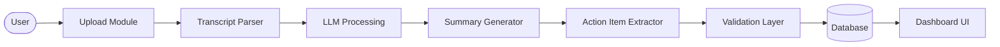

# AI Meeting Minutes Generator & Action Item Extractor

## Overview
This application automatically parses meeting transcripts (in `.txt` or `.docx` formats), uses Large Language Models (LLMs) to summarize the content, and extracts structured insights including Action Items, Decisions, Risks, and Deadlines. It features a lightweight plain-JS single-page frontend, a robust FastAPI backend with validation schemas, and supports exporting generated reports in Markdown and PDF formats.

## Architecture
The system processes data linearly through a distinct set of modules:



## Technology Stack
- **Backend Framework**: FastAPI (Python)
- **Data Validation**: Pydantic
- **Database**: SQLite (Local Dev) / SQLAlchemy ORM
- **LLM Integration**: httpx (OpenAI-compatible endpoints supported)
- **Document Processing**: `python-docx`, `fpdf2`
- **Frontend**: Plain HTML, Vanilla JS, and Custom CSS (Glassmorphism design, Inter font)

## Installation

1. **Clone the repository**:
   ```bash
   git clone <repository-url>
   cd project
   ```

2. **Set up a virtual environment** (recommended):
   ```bash
   python -m venv venv
   source venv/bin/activate  # On Windows use: venv\Scripts\activate
   ```

3. **Install backend dependencies**:
   ```bash
   pip install -r backend/requirements.txt
   ```

4. **Environment Variables**:
   ```bash
   cp .env.example .env
   ```
   Open the `.env` file and input your chosen LLM API key (e.g., `OPENAI_API_KEY`).

## Usage

Start the backend server. The application is configured to serve the frontend directly from FastAPI:
```bash
uvicorn backend.main:app --reload
```
Navigate to `http://localhost:8000` in your browser. You can upload transcripts, view meeting details, and search your history.

## API Documentation

### `GET /health`
- **Description**: Basic health check.
- **Request**: None
- **Response**: `{"status": "healthy", "service": "...", "version": "..."}`

### `POST /api/upload/transcript`
- **Description**: Upload a `.txt` or `.docx` transcript. Validates file format and rejects empty files.
- **Request**: `multipart/form-data` containing `file`
- **Response**: `{"file_id": "uuid", "filename": "...", "upload_timestamp": "...", "status": "success"}`

### `POST /api/process/{file_id}`
- **Description**: Triggers the parsing, LLM summarization (map-reduce), extraction, validation, and saves to the database.
- **Request**: None (Path parameter: `file_id`)
- **Response**: `{"meeting_id": "uuid", "status": "processed"}`

### `GET /api/meetings/{meeting_id}`
- **Description**: Fetches the fully extracted and structured JSON data for a processed meeting.
- **Request**: None (Path parameter: `meeting_id`)
- **Response**: 
  ```json
  {
    "id": "uuid",
    "filename": "...",
    "summary": "...",
    "key_topics": ["..."],
    "action_items": [{"task": "...", "owner": "...", "deadline": "..."}],
    "decisions": [...],
    "risks": [...],
    "deadlines": [...]
  }
  ```

### `GET /api/search?q={query}`
- **Description**: Searches across past meeting summaries and action items.
- **Request**: Query parameter `q` (e.g., `?q=budget`)
- **Response**: List of basic meeting metadata objects (`[{"id": "...", "filename": "...", "summary": "..."}]`)

### `GET /api/meetings/{meeting_id}/export?format={md|pdf}`
- **Description**: Generates and downloads a formatted report of the meeting insights.
- **Request**: Query parameter `format` (either `md` or `pdf`)
- **Response**: File download stream (`application/pdf` or `text/markdown`)

## Screenshots
*(Add your screenshots here)*

- **Upload View**: 
  ``
  *Capture the drag-and-drop upload interface in its initial state.*

- **Meeting Details View**: 
  ``
  *Capture the glassmorphic dashboard displaying summary, topics, and extracted action items.*

- **Search History View**: 
  ``
  *Capture the search bar and the grid of previously processed meeting cards.*

## Future Improvements
- **Robust Speaker Identification**: The current regex-based speaker mapping works for standard transcript formats (e.g. `Speaker:`), but could be improved using deeper NLP parsing or a dedicated diarization model.
- **PostgreSQL Migration**: The application uses SQLite for local development. For production deployments (e.g., on Render or Railway), migrate to PostgreSQL by updating the `DATABASE_URL` environment variable and installing the `psycopg2-binary` driver.
- **User Authentication**: Implement standard authentication to attach an actual user identity to the Audit logs rather than relying on anonymous processing records.
